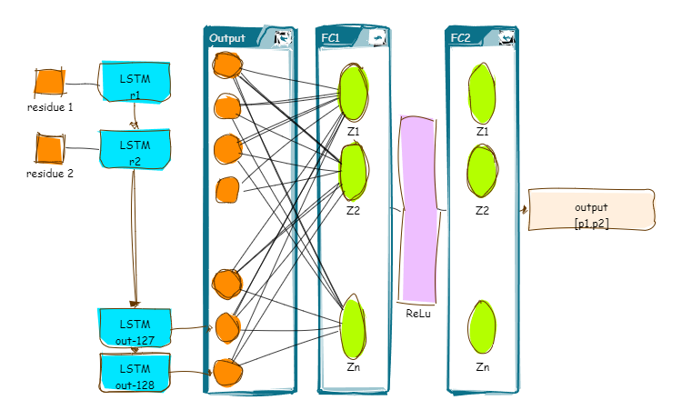

# Intro

The aims of this project is to predict localization of the protein based on sequence using RNN. This problem has a long history, there are a lot of avaliable tools and algorithms to predict subcellular localization of the protein based on the strucure. Machine learning and natural language processing is reasonable instruments for creating a predictive model. This [review](https://www.frontiersin.org/articles/10.3389/fbinf.2022.910531/full) collected the recent acheavments in that field.

The typical accuracy is aroud 65% [for example](https://link.springer.com/article/10.1007/s11517-020-02275-w) and this value can be used as the reference point.

# Dataset

For training the model I used [Uniprot database](https://www.uniprot.org/) with more than 40.000 proteins with described localizations, the typical keywords are: membrane, cytoplasm, mitochondrion and nucleus which represent usual localization of the proteins (add picture)

# Data preprocessing 
The actual dataset was obtained from Uniprot database, `uniprot_trembl_human` file.

## Localization
The information about localization was converted into 1x2 vector, where 2 is number of target localizations (membrane and nucleus), each position represent occurance of the corresponding keyword. For example:
Text
<pre>
CC   -!- SUBCELLULAR LOCATION: <b>Nucleus</b>. Cytoplasm. Note=Shuttles between the
CC       nucleus and the cytoplasm. Upon muscle cells differentiation, it
CC       accumulates in the nuclei of myotubes, suggesting a positive role of
CC       nuclear HDAC4 in muscle differentiation. The export to cytoplasm
CC       depends on the interaction with a 14-3-3 chaperone protein and is due
CC       to its phosphorylation at Ser-246, Ser-467 and Ser-632 by CaMK4 and
CC       SIK1. The nuclear localization probably depends on sumoylation.
CC       Interaction with SIK3 leads to HDAC4 retention in the cytoplasm (By
CC       similarity). {ECO:0000250|UniProtKB:Q6NZM9}.
</pre>

Encoded location vector
`[1, 1]`

## Sequence
The protein sequence is encoded as one-hot vector using 24 residue symbols (including non-standard, line B is Aspartic acid or Asparagine) plus '#' as the placeholder when sequence is shorter than threshold. 

# Model
Model is LSTM with 3 fully connected layers

This model was trained with 70 epochs, batch size=256. 

# Results
The balanced accuracy for this model is **0.73%** for prediction membrane localization and **0.76** for nuclear localization. 
